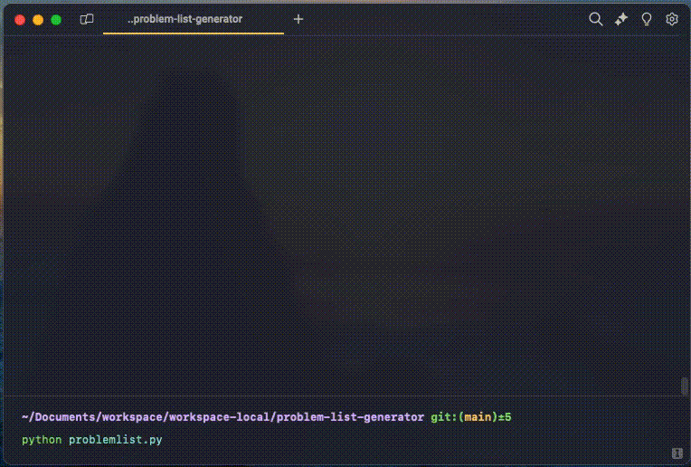

# Problem List Generator
`problem-list-generator` is an experimental local LLM trained to generate a list of active clinical problems from a History and Physical (H&P) section of a clinical note. 

This is part of [a small personal experiment](https://x.com/samarthrawal/status/1817686625364922582) to train small, fast, local language models that can assist clinicians when writing medical notes. It can be run completely offline, without any data leaving your local machine.

# Technical Details
This model was finetuned using synthetic clinical data generated with `Llama 3.1 405b`. The model itself is a LORA finetune of `Meta-Llama-3.1-8B-Instruct`.

This repository contains a basic Python script to inference the model via Ollama.

# Setup
1. Clone this repository
1. Download the GGUF model from [here](https://huggingface.co/samrawal/problem-list-generator-Q8_0-GGUF) and place in same directory as the repo.
3. Add the model to Ollama: `ollama create problemlist -f ProblemList.Modelfile`
4. Run the Python script: `python problemlist.py`